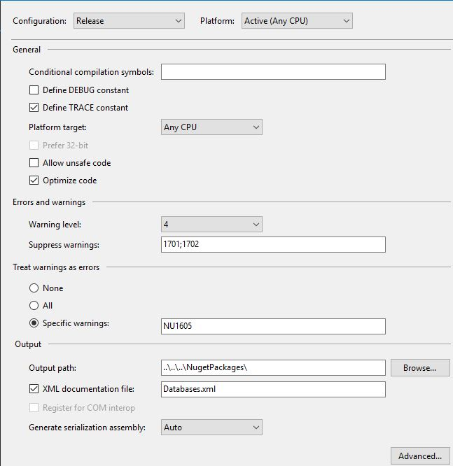
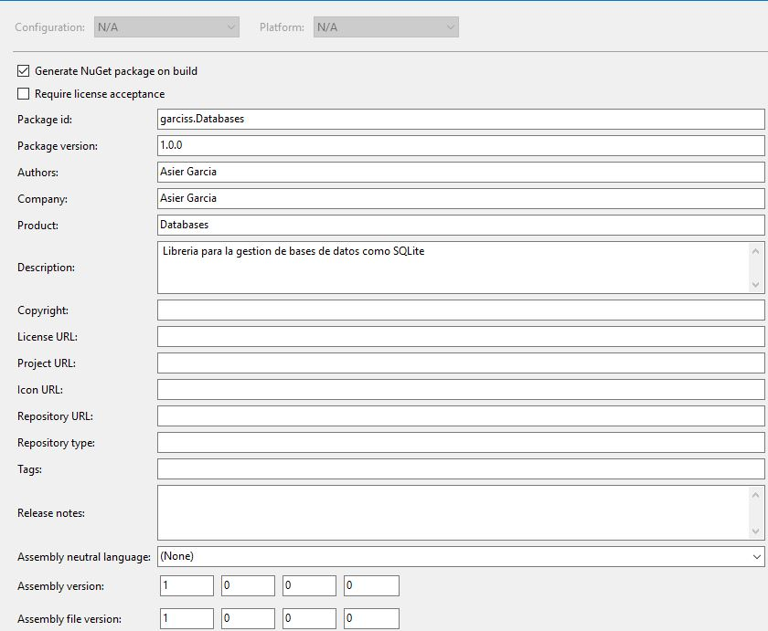

# NugetPackages

Se han configurado las librerias para que se compilen y se generen paquetes nuget automaticamente para poder distributir los ensamblados `.dll` como los paquetes

---

Esta es la configuracion de Compilacion en Release, cuando se hace una Release es porque la libreria funciona y se puede pasar a "Produccion" y optimizar el codigo, asique se guardaran las `.dll` en NugetPackages y tambien se creara un fichero `.xml` como documentacion del ensamblado, este se generara en la ruta del proyecto normal y se agregara al paquete NuGet.

---

Esta es la configuracion del paquete NuGet

- **Package id:** Nombre del paquete, se usara para buscarlo en el repositorio por ejemplo

- **Package Version:** Version del paquete, por defecto 1.0, pero cuando se saquen mejoras grandes se debera de subir para actualizar automaticamente los paquetes en los diferentes proyectos

- **Authors:** Nombre del creador o creadores de la libreria 

- **Company:** Nombre de la empresa que lo crea, si no es empresa se pondra el mismo nombre que el Author

- **Product:** Nombre del proyecto

- **Descripcion:** Una breve descripcion de lo que consta el proyecto
